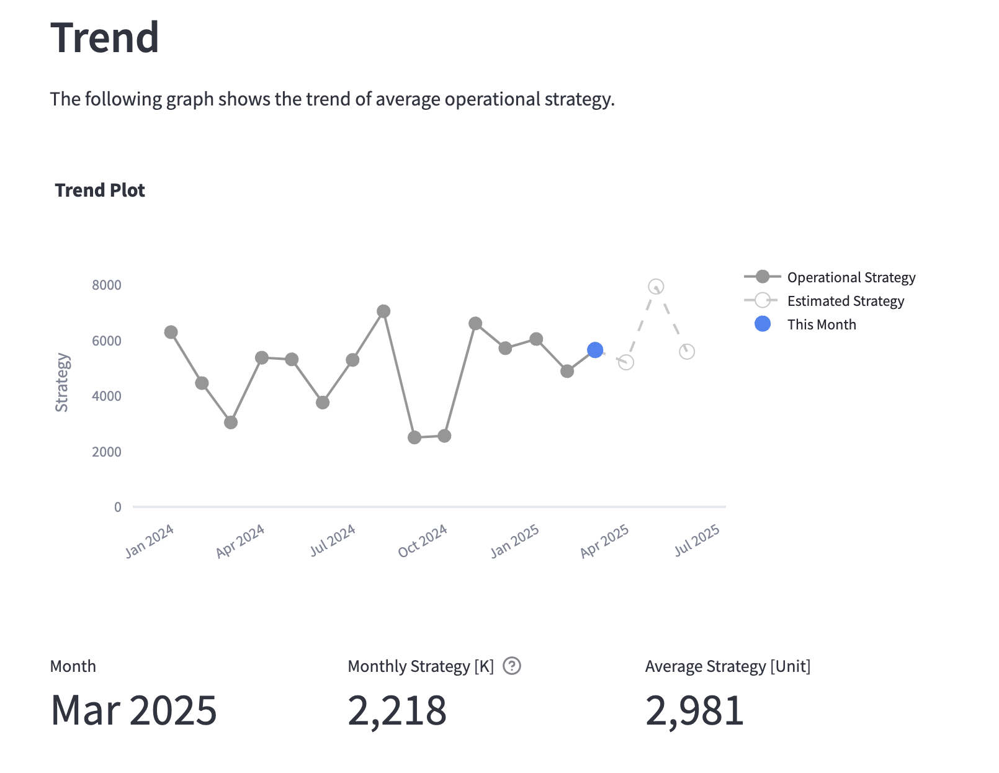
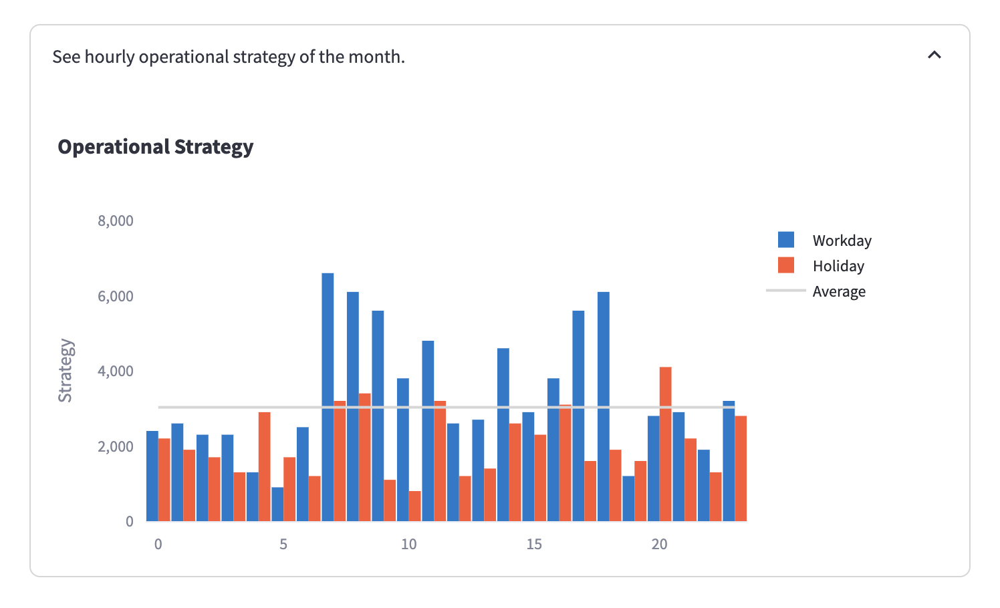
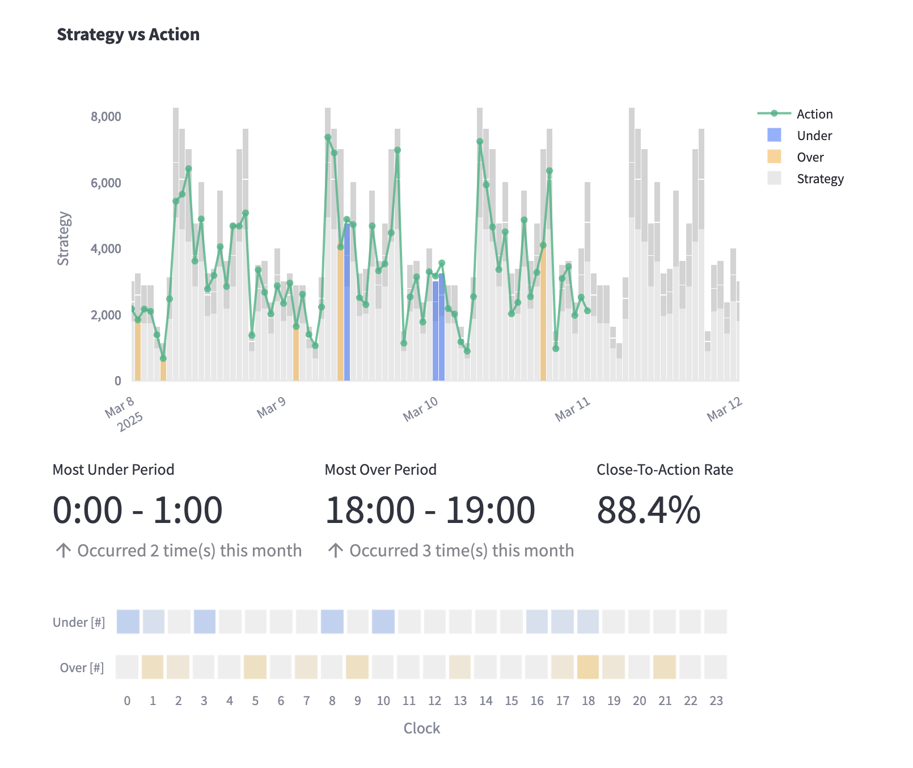

# Streamlit Strategy Evaluation Template

## Overview

This project provides a **Streamlit-based template** for evaluating strategies that change over time. It serves as a flexible tool that can be adapted for different scenarios, particularly for analyzing and visualizing simulated strategy performance. Since this is a template, all the data used are **simulated based on experience**, and various techniques are implemented to generate realistic data patterns.

## Features

- 📊 **Long-Term Trend Analysis**

  - Displays the **monthly trend** of the average value of the given strategy.
  - Helps identify overall patterns and evaluate the effectiveness of strategy adjustments over time.

- 🛠️ **Short-Term Strategy Under Different Scenarios**

  - Provides example strategies for **weekdays vs. holidays**, demonstrating how different conditions may require distinct approaches.
  - Allows for scenario-based evaluation of strategic differences.

- 🔄 **Execution Comparison**

  - Compares the **planned strategy vs. real execution** to assess strategy performance.
  - Includes **key performance indicators (KPIs)** such as the rate describing how closely the strategy aligns with real actions.
  - Additionally, it provides recommended actions based on the comparison to improve strategic alignment and execution efficiency.

## Installation

To set up and run the project locally, follow these steps:

### 1️⃣ Clone the Repository

```bash
git clone https://github.com/chou1110/Project_Ringo.git
cd /Project_Ringo
```

### 2️⃣ Install Dependencies

Ensure you have Python installed, then run:

```bash
pip install -r requirements.txt
```

### 3️⃣ Run the Streamlit App

```bash
streamlit run app.py
```

### 4️⃣ Open in Browser

After running the command, the app should open automatically. If not, manually open the URL display in the terminal.

## Snapshots

Below are some snapshots of the app showcasing its key features:

### 📌 Long-Term Trend Analysis

This visualization displays the **monthly trend of the average operational strategy**, helping users analyze long-term patterns and assess how strategy adjustments perform over time.


### 📌 Short-Term Strategy Under Different Scenarios

This chart compares **weekday and holiday strategies**, demonstrating how operational strategies may differ based on different conditions. It allows users to evaluate and fine-tune strategy adjustments for various scenarios.


### 📌 Execution Comparison

This visualization compares the **planned strategy vs. real execution**, highlighting over- and under-execution periods. It also includes key performance indicators, such as the **Close-To-Action Rate**, to measure how closely the real actions align with the strategy.